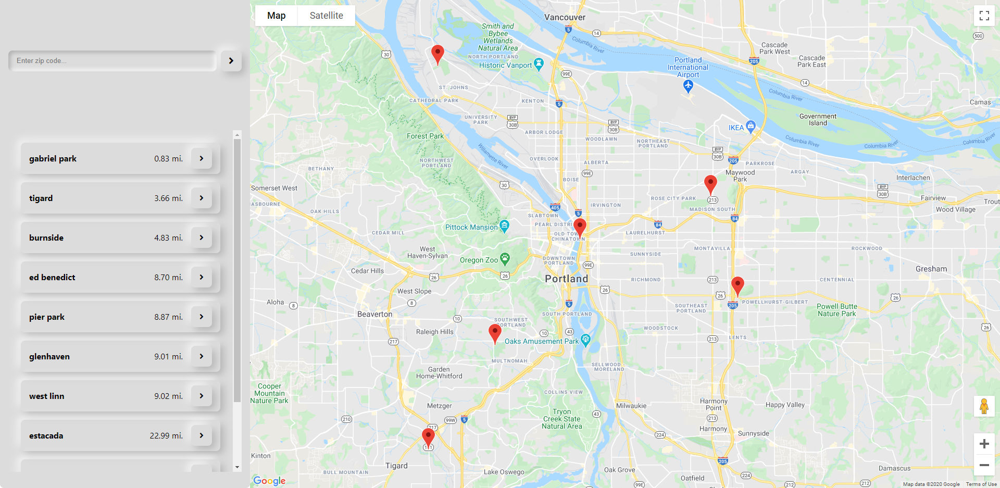

# Skatepark Locator App

> Web application using Google Maps API to return sorted list of skate park locations to user based on user's current location or by geocoded search

## Overview

App uses the navigator's <code>getCurrentPosition()</code> method or the <code>Maps Geocoding API</code> to compare a relative position against those of the skateparks in the data set <code>locations</code>.

<code>scripts.js</code> has data object for locations, which are referenced when the app is loaded or when a search is submitted.

The <code>calculateDistance()</code> function takes in both the user's coordinates and the locations array, then maps through the array and uses the Haversine Formula to calculate relative distance between the user and all positions in the locations array. Then, <code>renderList()</code> resets the order of the list items rendered in the locations list of the UI.

When a search is performed, the same logic takes place after the user's zip code search is geocoded into their coordinates.

## Concepts

* Google Maps API
  * JavaScript API
  * Geocoding API
  * *Haversine formula

* JavaScript
  * asynchronous functions
  * <code>.then()</code>
  * ES6 arrow functions
  * ES6 destructuring assignment syntax
  * ES6 let, const variables
  

### Author

[Brian Beal](https://github.com/brianwbeal)

> [linkedin](https://www.linkedin.com/in/brianwbeal/)

### Version

1.0.0

## Live Demo

[demo](https://brianwbeal.github.io/skatepark-locator/)